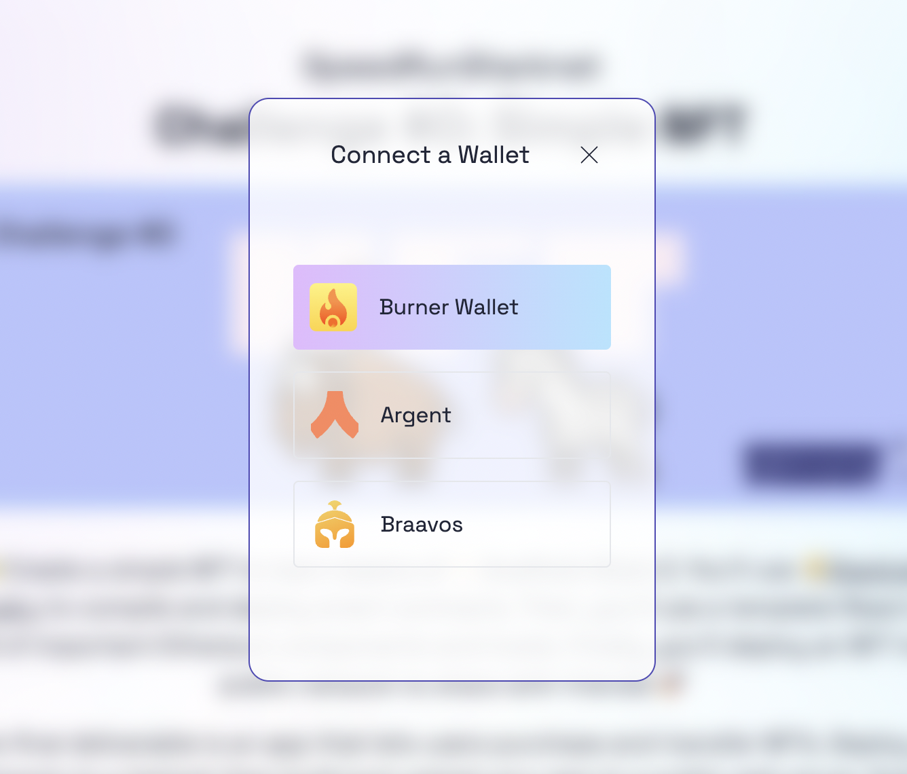
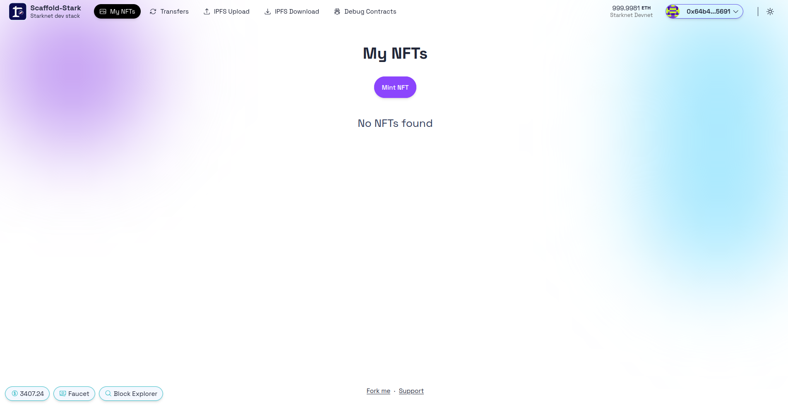
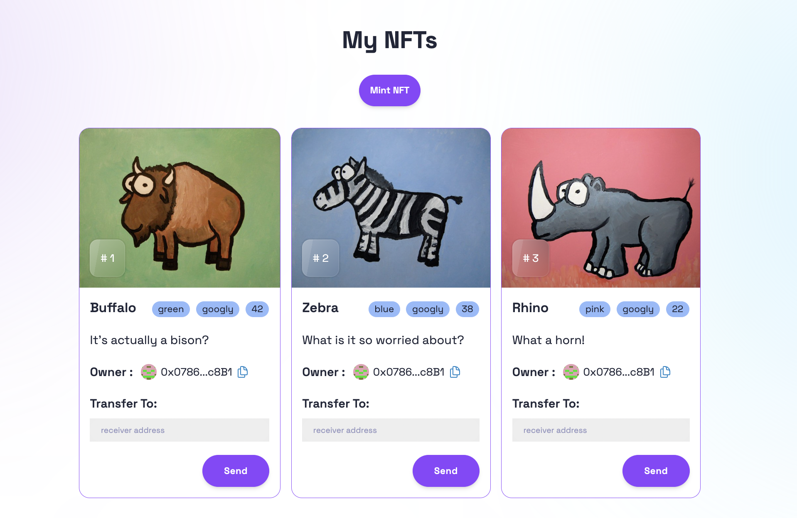

# 🚩 Challenge #0: 🎟 Simple NFT Example


📚 This tutorial is meant for developers that already understand the 🖍️ basics: [Starklings](https://starklings.app/) or [Node Guardians](https://nodeguardians.io/campaigns?f=3%3D2)

🎫 Create a simple NFT:

👷‍♀️ You'll compile and deploy your first smart contract. Then, you'll use a template React app full of important Starknet components and hooks. Finally, you'll deploy an NFT to a public network to share with friends! 🚀

🌟 The final deliverable is an app that lets users purchase and transfer NFTs. Deploy your contracts to a testnet, then build and upload your app to a public web server.

💬 Submit this challenge, meet other builders working on this challenge or get help in the [Builders telegram chat](https://t.me/+wO3PtlRAreo4MDI9)!

## Checkpoint 0: 📦 Environment 📚

Before you begin, you need to install the following tools:

- [Node (>= v18.17)](https://nodejs.org/en/download/)
- Yarn ([v1](https://classic.yarnpkg.com/en/docs/install/) or [v2+](https://yarnpkg.com/getting-started/install))
- [Git](https://git-scm.com/downloads)
- [Rust](https://rust-lang.org/tools/install)
- [asdf](https://asdf-vm.com/guide/getting-started.html)
- [Cairo 1.0 extension for VSCode](https://marketplace.visualstudio.com/items?itemName=starkware.cairo1)

### Starknet-devnet version

To ensure the proper functioning of scaffold-stark, your local `starknet-devnet` version must be `0.2.3`. To accomplish this, first check your local starknet-devnet version:

```sh
starknet-devnet --version
```

If your local starknet-devnet version is not `0.2.3`, you need to install it.

Install Starknet-devnet `0.2.3` via `asdf` ([instructions](https://github.com/gianalarcon/asdf-starknet-devnet/blob/main/README.md)).

### Scarb version

To ensure the proper functioning of scaffold-stark, your local `Scarb` version must be `2.9.2`. To accomplish this, first check your local Scarb version:

```sh
scarb --version
```

If your local Scarb version is not `2.9.2`, you need to install it.

- Install Scarb `2.9.2` via `asdf` ([instructions](https://docs.swmansion.com/scarb/download.html#install-via-asdf)).

### Starknet Foundry version

To ensure the proper functioning of the tests on scaffold-stark, your Starknet Foundry version must be 0.34.0. To accomplish this, first check your Starknet Foundry version:

```sh
snforge --version
```

If your Starknet Foundry version is not `0.35.1`, you need to install it.

- Install Starknet Foundry `0.35.1` via `asdf` ([instructions](https://foundry-rs.github.io/starknet-foundry/getting-started/installation.html#installation-via-asdf)).

### Compatible versions

- Starknet-devnet - v0.2.3
- Scarb - v2.9.2
- Snforge - v0.35.1
- Cairo - v2.9.2
- RPC - v0.7.1

Make sure you have the compatible versions otherwise refer to [Scaffold-Stark Requirements](https://github.com/Scaffold-Stark/scaffold-stark-2?.tab=readme-ov-file#requirements)

### Docker Option for Environment Setup

<details>

For an alternative to local installations, you can use Docker to set up the environment.

- Install [Docker](https://www.docker.com/get-started/) and [VSCode Dev Containers extension](https://marketplace.visualstudio.com/items?itemName=ms-vscode-remote.remote-containers).
- A pre-configured Docker environment is provided via `devcontainer.json` using the `starknetfoundation/starknet-dev:2.9.2` image.

For complete instructions on using Docker with the project, check out the [Requirements Optional with Docker section in the README](https://github.com/Scaffold-Stark/scaffold-stark-2?tab=readme-ov-file#requirements-alternative-option-with-docker) for setup details.
</details>

Then download the challenge to your computer and install dependencies by running:

```sh
git clone https://github.com/Scaffold-Stark/speedrunstark.git challenge-0-simple-nft
cd challenge-0-simple-nft
git checkout challenge-0-simple-nft
yarn install
```

> in the same terminal, start your local network (a local instance of a blockchain):

```bash
yarn chain
```

> To run a fork : `yarn chain --fork-network <URL> [--fork-block <BLOCK_NUMBER>]`

> in a second terminal window, 🛰 deploy your contract (locally):

```sh
cd challenge-0-simple-nft
yarn deploy
```

> in a third terminal window, start your 📱 frontend:

```sh
cd challenge-0-simple-nft
yarn start
```

📱 Open [http://localhost:3000](http://localhost:3000) to see the app.

---

## Checkpoint 1: ⛽️ Gas & Wallets 👛

> 🔥 We'll use burner wallets on localhost.

> 👛 Explore how burner wallets work in 🏗 Scaffold-Stark. You will notice the `Connect Wallet` button on the top right corner. After click it, you can choose the `Burner Wallet` option. You will get a default prefunded account.

## 

## Checkpoint 2: 🖨 Minting

> ✏️ Mint some NFTs! Click the **MINT NFT** button in the `My NFTs` tab.



👀 You should see your NFTs start to show up:



👛 Open an window Browser and navigate to <http://localhost:3000>

🎟 Transfer an NFT from one address to another using the UI:


👛 Try to mint an NFT from a different address.

🕵🏻‍♂️ Inspect the `Debug Contracts` tab to figure out what address is the owner of YourCollectible?

🔏 You can also check out your smart contract `YourCollectible.cairo` in `packages/snfoundry/contracts`.

💼 Take a quick look at your deploy script `deploy.ts` in `packages/snfoundry/script-ts`.

📝 If you want to edit the frontend, navigate to `packages/nextjs/app` and open the specific page you want to modify. For instance: `/myNFTs/page.tsx`. For guidance on [routing](https://nextjs.org/docs/app/building-your-application/routing/defining-routes) and configuring [pages/layouts](https://nextjs.org/docs/app/building-your-application/routing/pages-and-layouts) checkout the Next.js documentation.

---

## Checkpoint 3: 💾 Deploy your contract! 🛰

🛰 Ready to deploy to a public testnet?!?

> Find the `packages/nextjs/scaffold.config.ts` file and change the `targetNetworks` to `[chains.sepolia]`.


🔐 Prepare your environment variables.

> Find the `packages/snfoundry/.env` file and fill the env variables related to Sepolia testnet with your own wallet account address and private key.

> Follow up [Wallet Account](https://docs.starknet.io/quick-start/set-up-an-account) to install the example Wallet on Browser
 - Visit [here](https://www.argent.xyz/argent-x) to dowload ArgentX wallet
 - visit [here](https://braavos.app/) to dowload Braavos wallet

> You will need to get some ETH or STRK Sepolia tokens to deploy your contract to Sepolia testnet.Some popular faucets are [Starknet Faucet](https://starknet-faucet.vercel.app/) and [Blastapi Starknet Sepolia Eth](https://blastapi.io/faucets/starknet-sepolia-eth)

🚀 Deploy your NFT smart contract with `yarn deploy`.

> you input `yarn deploy --network sepolia`.

---

## Checkpoint 4: 🚢 Ship your frontend! 🚁

> 🦊 Since we have deployed to a public testnet, you will now need to connect using a wallet you own(Argent X or Braavos).


> You should see the correct network in the frontend (<http://localhost:3000>):


> 💬 Hint: For faster loading of your transfer page, consider updating the `fromBlock` passed to `useScaffoldEventHistory` in [`packages/nextjs/app/transfers/page.tsx`](https://github.com/Scaffold-Stark/scaffold-stark-2/blob/main/packages/nextjs/hooks/scaffold-stark/useScaffoldEventHistory.ts) to `blocknumber - 10` at which your contract was deployed. Example: `fromBlock: 3750241n` (where `n` represents its a [BigInt](https://developer.mozilla.org/en-US/docs/Web/JavaScript/Reference/Global_Objects/BigInt)). To find this blocknumber, search your contract's address on Starkscan and find the `Contract Creation` transaction line.

🚀 Deploy your NextJS App

```shell
yarn vercel
```

> Follow the steps to deploy to Vercel. Once you log in (email, github, etc), the default options should work. It'll give you a public URL.

> If you want to redeploy to the same production URL you can run `yarn vercel --prod`. If you omit the `--prod` flag it will deploy it to a preview/test URL.

⚠️ Run the automated testing function to make sure your app passes

```shell
yarn test
```

#### Configuration of Third-Party Services for Production-Grade Apps

By default, 🏗 Scaffold-Stark provides predefined Open API endpoint for some services such as Blast. This allows you to begin developing and testing your applications more easily, avoiding the need to register for these services.
This is great to complete your **SpeedRunStark**.

For production-grade applications, it's recommended to obtain your own API keys (to prevent rate limiting issues). You can configure these at:

🔷 `RPC_URL_SEPOLIA` variable in `packages/snfoundry/.env` and `packages/nextjs/.env.local`. You can create API keys from the [Alchemy dashboard](https://dashboard.alchemy.com/).

> 💬 Hint: It's recommended to store env's for nextjs in Vercel/system env config for live apps and use .env.local for local testing.

---

> 🏃 Head to your next challenge [here](https://github.com/Scaffold-Stark/speedrunstark/tree/challenge-1-decentralized-staking).

> 💭 Problems, questions, comments on the stack? Post them to the [🏗 Scaffold-Stark developers chat](https://t.me/+wO3PtlRAreo4MDI9)
